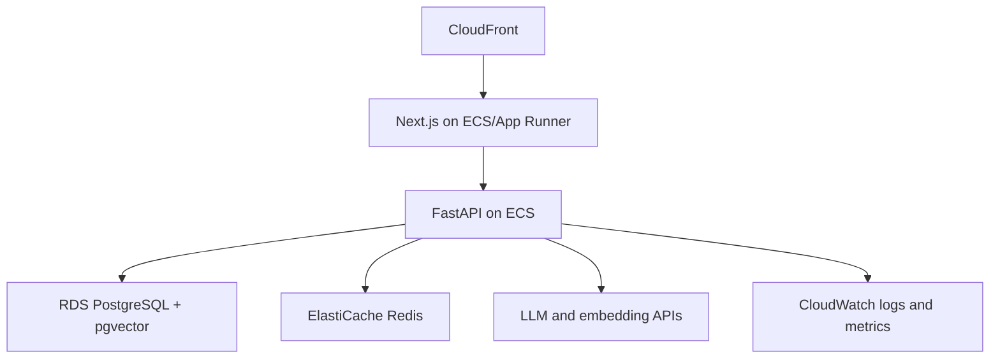

# Architecture

JinzaIQ uses a split frontend/backend architecture.

The backend exposes versioned REST APIs under `/api/v1`, validates all external input with Pydantic, stores relational data through SQLAlchemy, and isolates domain logic in services. The matching service combines skill overlap, experience, Japanese language requirements, visa caution, salary, location, and embedding similarity.

The frontend is a Next.js application with server-rendered pages that call the API using a demo account. This keeps the demo friction low while preserving real JWT authentication paths in the backend.

Production target:

## Key Decisions

- Mock AI and embeddings are default so the app works without secrets.
- Provider interfaces keep OpenAI or other vendors swappable.
- Visa and salary claims are carefully bounded.
- Seeded fictional companies avoid pretending to have sourced real job listings.
- SQLite is enabled locally for fast onboarding; Docker includes PostgreSQL and Redis for production parity.
- Ingestion is source-oriented through a `JobSource` protocol, with JSON import implemented and CSV/API sources intended to share the same normalized `JobRecord` contract.
- Background AI/embedding jobs expose API status through a local queue stub, designed to be replaced by Redis-backed Celery or RQ in AWS.
- Vercel hosts only the Next.js frontend. The FastAPI API remains a separate deployable service so long-running Python, PostgreSQL, Redis, and worker concerns stay outside serverless frontend hosting.
