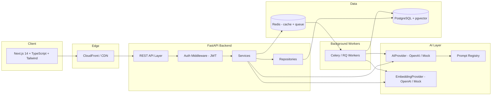
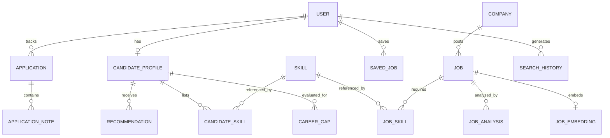
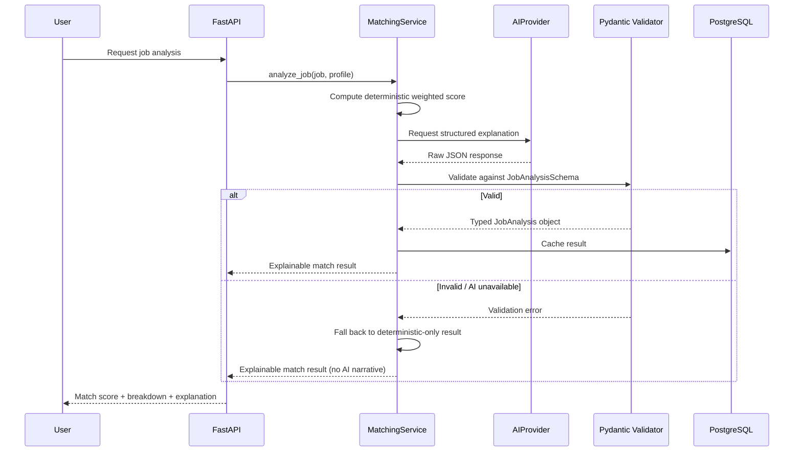
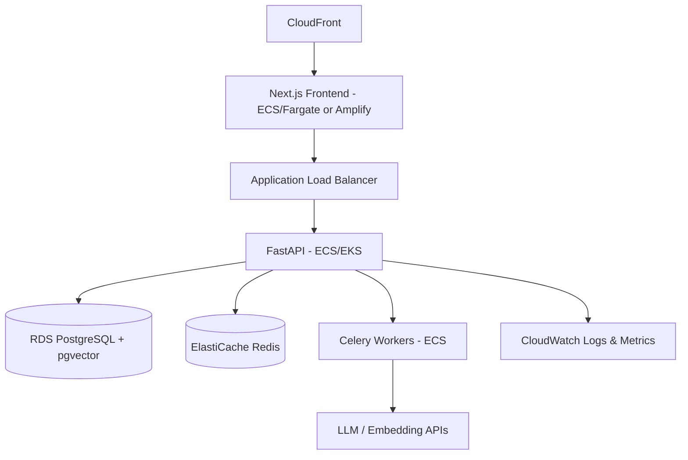

<div align="center">

# 🗾 JinzaIQ

### AI-powered intelligence for finding and preparing for tech careers in Japan

*人材IQ — "Talent Intelligence"*

[](#license)
[](#tech-stack)
[](#tech-stack)
[](#tech-stack)
[](#tech-stack)
[](#tech-stack)
[](#vector-search)
[](#local-development)
[](#cicd)

</div>

---

## 📖 Table of Contents

- [Overview](#-overview)
- [Why This Project Exists](#-why-this-project-exists)
- [Feature Highlights](#-feature-highlights)
- [Architecture](#-architecture)
- [Tech Stack](#-tech-stack)
- [Database Schema](#-database-schema)
- [AI Architecture](#-ai-architecture)
- [Vector Search](#-vector-search)
- [Explainable Match Scoring](#-explainable-match-scoring)
- [Project Structure](#-project-structure)
- [Local Development](#-local-development)
- [Environment Variables](#-environment-variables)
- [Running Tests](#-running-tests)
- [Docker Setup](#-docker-setup)
- [AWS Deployment](#-aws-deployment)
- [CI/CD](#-cicd)
- [Security](#-security)
- [Roadmap](#-roadmap)
- [License](#-license)

---

## 🌸 Overview

**JinzaIQ** is a full-stack platform that helps engineers find and prepare for technology jobs in Japan. It combines traditional structured search with a hybrid AI matching engine — deterministic scoring, embedding-based semantic similarity, and LLM-generated explanations — to answer one question clearly:

> *"How well do I actually fit this role, and what should I learn to fit it better?"*

Rather than a generic job board, JinzaIQ is built around the specific realities of the Japanese tech hiring market: language requirements (JLPT levels), visa sponsorship ambiguity, bilingual work environments, and region-specific tech hubs (Tokyo, Osaka, Fukuoka, and beyond).

## 🎯 Why This Project Exists

JinzaIQ was built as a portfolio-grade demonstration of production engineering, not a CRUD tutorial project. It intentionally exercises the skills that matter for real software engineering roles:

- Designing a normalized relational schema and a hybrid AI/vector search system
- Building secure, typed, testable APIs
- Treating LLM output as **untrusted input** that must be schema-validated
- Making infrastructure decisions (Docker → CI → AWS) that mirror how a real startup ships software
- Writing documentation good enough that a stranger could run the project unassisted

## ✨ Feature Highlights

| Module | What it does |
|---|---|
| 🔍 **Job Discovery** | Keyword, semantic, and hybrid search with rich filters — location, salary, Japanese/English requirement, visa status, experience level |
| 🧠 **AI Job Analyzer** | Structured, Pydantic-validated LLM analysis: match breakdown, risks, and recommendations — never raw free text |
| 🪪 **Candidate Profiles** | Structured profile builder + resume paste/upload with skill extraction and normalization |
| 🎯 **Personalized Matching** | Configurable weighted scoring (skills, experience, language, visa, location, salary, education, semantic similarity) |
| 📊 **Explainable Match Score** | Every score comes with a category breakdown and a plain-language "why" — never a bare percentage |
| 🗺️ **Career Gap Analysis** | Shows current vs. required skills, importance, difficulty, and a suggested learning order per target role |
| 🚀 **Career Roadmap** | Phased, trackable learning plans (Not Started → Learning → Intermediate → Advanced) |
| 💡 **Recommendation Engine** | Vector-search-driven "Recommended for you" using candidate + job embeddings |
| 📌 **Saved Jobs & Applications** | Full application pipeline: Saved → Applied → Interview → Offer → Rejected, with notes |
| ⚖️ **Job Comparison** | Side-by-side comparison across salary, visa, language, skills, and fit |
| 🏢 **Company Profiles** | Aggregated view of a company's open roles, tech stack, and language/visa posture |
| 🛂 **Visa-Aware Language** | Sponsorship is always framed as *"likely / possible / not mentioned"* — never a legal guarantee |
| 🛠️ **Admin Console** | Job ingestion, deactivation, duplicate review, and AI-failure inspection |
| 📈 **Analytics** | Views, saves, applications, interviews, and skill-gap trends visualized |

---

## 🏛 Architecture



**Design principles:**

1. **Deterministic-first matching** — the LLM explains scores, it does not silently invent them.
2. **Swappable AI providers** — every AI/embedding call runs through an interface so the app works fully offline with `MockAIProvider` / `MockEmbeddingProvider`.
3. **Never block the request thread on AI** — embedding generation and job analysis run as background jobs.
4. **Schema-validate everything from the LLM** — Pydantic models reject malformed AI output before it reaches the client.

Full breakdown lives in [`ARCHITECTURE.md`](./ARCHITECTURE.md).

---

## 🧰 Tech Stack

<table>
<tr>
<td valign="top" width="50%">

**Backend**
- Python 3.12 + FastAPI
- Pydantic v2 (schema validation)
- SQLAlchemy 2.0 + Alembic (migrations)
- PostgreSQL 16 + `pgvector`
- Redis (cache + queue broker)
- Celery / RQ (background workers)
- JWT-based authentication

</td>
<td valign="top" width="50%">

**Frontend**
- Next.js 14 (App Router)
- TypeScript (strict mode)
- Tailwind CSS
- React Query / server components for data fetching
- Playwright (E2E)

</td>
</tr>
<tr>
<td valign="top">

**AI / Search**
- Pluggable `AIProvider` (OpenAI / Mock)
- Pluggable `EmbeddingProvider` (OpenAI / Mock)
- pgvector-based semantic + hybrid search
- Versioned, file-based prompt registry

</td>
<td valign="top">

**DevOps**
- Docker + docker-compose
- GitHub Actions (lint, type-check, test, build)
- Terraform scaffolding (VPC, ECS/EKS, RDS, ElastiCache, S3)
- Structured logging + `/health` and `/ready` probes

</td>
</tr>
</table>

---

## 🗄 Database Schema



Core entities: `User`, `CandidateProfile`, `Skill`, `CandidateSkill`, `Job`, `Company`, `JobSkill`, `JobAnalysis`, `JobEmbedding`, `SavedJob`, `Application`, `ApplicationNote`, `CareerGap`, `Recommendation`, `SearchHistory` — all UUID-keyed, timestamped, and indexed for common query patterns.

---

## 🤖 AI Architecture

The AI layer treats language models as **untrusted, swappable components**, never a source of ground truth.



- **Weighted scoring is configurable**: skills 35%, experience 20%, language 15%, visa 10%, location 5%, salary 5%, education 5%, semantic similarity 5%.
- **Retries + graceful fallback**: transient AI failures degrade to deterministic scoring, never a broken page.
- **Prompt versioning**: prompts live in dedicated, version-tagged modules — never inline strings scattered through services.
- **Rate limiting & caching**: expensive AI calls are throttled and repeated analyses are cached.

---

## 🔎 Vector Search

Embeddings are generated for job descriptions, job requirements, candidate profiles, and skill descriptions, stored in PostgreSQL via `pgvector`, and queried through three modes:

| Mode | Behavior |
|---|---|
| **Keyword** | Traditional full-text search over structured fields |
| **Semantic** | Cosine-similarity search over embeddings — finds relevant jobs even without exact phrase matches |
| **Hybrid** | Combines keyword filtering with semantic re-ranking for the best of both |

> Example: a search for *"English-speaking backend jobs using AWS"* surfaces relevant postings even when that exact phrase never appears in the listing.

---

## 📐 Explainable Match Scoring

JinzaIQ never returns a bare percentage. Every match includes a full breakdown and a plain-language explanation:

```
Overall Match: 87%

Skills:      92%   ✓ Python  ✓ React  ✓ PostgreSQL  ✓ AWS
Experience:  80%
Language:   100%
Visa:        70%   Sponsorship not explicitly stated
Location:   100%
Salary:      85%

Strongest matches: Python, AWS, PostgreSQL
Main gap: Java / Spring Boot, Kubernetes

Recommended next steps:
  1. Spring Boot
  2. Kubernetes
  3. Japanese N2
```

Visa sponsorship and salary data are always labeled with their confidence level (`Listed` / `Estimated` / `Unknown`, `Likely` / `Possible` / `Not mentioned`) — the platform never presents inference as fact, and always recommends confirming directly with the employer.

---

## 📁 Project Structure

```
jinzaiq/
├── backend/
│   └── app/
│       ├── api/            # versioned REST routes
│       ├── core/            # config, security, logging
│       ├── models/          # SQLAlchemy models
│       ├── schemas/         # Pydantic request/response + AI schemas
│       ├── services/        # business logic (matching, scoring, gap analysis)
│       ├── repositories/    # data access layer
│       ├── ai/               # AIProvider implementations + prompt registry
│       ├── embeddings/      # EmbeddingProvider implementations
│       ├── jobs/             # JobSource ingestion (Seed / CSV / API)
│       ├── auth/             # JWT auth, hashing, dependencies
│       └── workers/         # Celery/RQ background tasks
├── frontend/
│   └── src/
│       ├── app/              # Next.js App Router pages
│       ├── components/
│       ├── lib/
│       └── hooks/
├── infra/
│   └── terraform/            # optional AWS scaffolding (VPC, ECS/EKS, RDS, S3)
├── docker-compose.yml
├── .github/workflows/
├── README.md
├── ARCHITECTURE.md
├── API.md
├── SECURITY.md
├── CONTRIBUTING.md
└── DEVELOPMENT.md
```

---

## 🚀 Local Development

**Prerequisites:** Docker & Docker Compose, Node.js 20+, Python 3.12+

```bash
# 1. Clone and configure
git clone https://github.com/<your-username>/jinzaiq.git
cd jinzaiq
cp .env.example .env

# 2. Start everything (Postgres, Redis, backend, frontend, worker)
docker compose up --build

# 3. Run database migrations
docker compose exec backend alembic upgrade head

# 4. Seed realistic demo data (100+ jobs, 30+ companies, 100+ skills)
docker compose exec backend python -m app.jobs.seed

# App is now running:
# Frontend → http://localhost:3000
# Backend API docs → http://localhost:8000/docs
```

> No AI API key required to run the app — `MockAIProvider` and `MockEmbeddingProvider` keep every feature fully functional offline.

---

## 🔐 Environment Variables

Configured via `.env` (see `.env.example` for the full annotated list):

| Variable | Purpose |
|---|---|
| `DATABASE_URL` | PostgreSQL connection string |
| `REDIS_URL` | Redis connection string |
| `JWT_SECRET` | Signing key for auth tokens |
| `AI_PROVIDER` | `openai` \| `mock` |
| `EMBEDDING_PROVIDER` | `openai` \| `mock` |
| `OPENAI_API_KEY` | Only required when using the real provider |
| `MATCH_WEIGHTS_*` | Configurable scoring weights |
| `CORS_ORIGINS` | Allowed frontend origins |

Secrets are never committed to Git and never exposed to the frontend bundle.

---

## 🧪 Running Tests

```bash
# Backend — unit, API, DB, auth, AI-schema, and matching-algorithm tests
docker compose exec backend pytest -v

# Frontend — component and page tests
cd frontend && npm run test

# End-to-end (Playwright) — signup, login, profile, search, analysis, save, apply
cd frontend && npm run test:e2e

# Linting & type checking
docker compose exec backend ruff check . && mypy app
cd frontend && npm run lint && npm run type-check
```

---

## 🐳 Docker Setup

```bash
docker compose up --build       # full local stack
docker compose down -v          # tear down + reset volumes
```

Services: `frontend`, `backend`, `worker`, `postgres` (with `pgvector`), `redis`.

---

## ☁️ AWS Deployment



Optional Terraform modules under `infra/terraform/` scaffold: VPC, ECS/EKS cluster, RDS PostgreSQL, ElastiCache, S3, CloudWatch, and IAM roles. AWS is **never required** for local development.

---

## ⚙️ CI/CD

GitHub Actions runs on every push/PR:

1. **Lint** — `ruff` (backend), `ESLint` (frontend)
2. **Type check** — `mypy` (backend), `tsc --noEmit` (frontend, strict mode)
3. **Test** — pytest suite + frontend component tests
4. **Build** — backend Docker image + frontend production build

---

## 🛡 Security

- Passwords hashed with a strong adaptive algorithm — never stored in plaintext
- JWT-based auth with protected route middleware and role-based authorization
- Input validation on every endpoint via Pydantic
- CORS explicitly configured, no wildcard origins in production
- Rate limiting on auth and AI-analysis endpoints
- SQL injection protection via parameterized ORM queries
- XSS-safe rendering on the frontend, CSRF protection where session-based flows apply
- Secrets loaded exclusively from environment variables — nothing committed to Git

Full threat model and assumptions documented in [`SECURITY.md`](./SECURITY.md).

---

## 🗺 Roadmap

- [ ] Real job-board API integrations (in addition to CSV/seed ingestion)
- [ ] Multi-currency salary normalization with live FX rates
- [ ] Resume-to-profile AI extraction improvements
- [ ] Company-side employer dashboard
- [ ] Mobile app (React Native)

---

## 📄 License

Released under the [MIT License](./LICENSE).

<div align="center">

Built with ☕, 頑張って, and a healthy respect for `pgvector`.

</div>