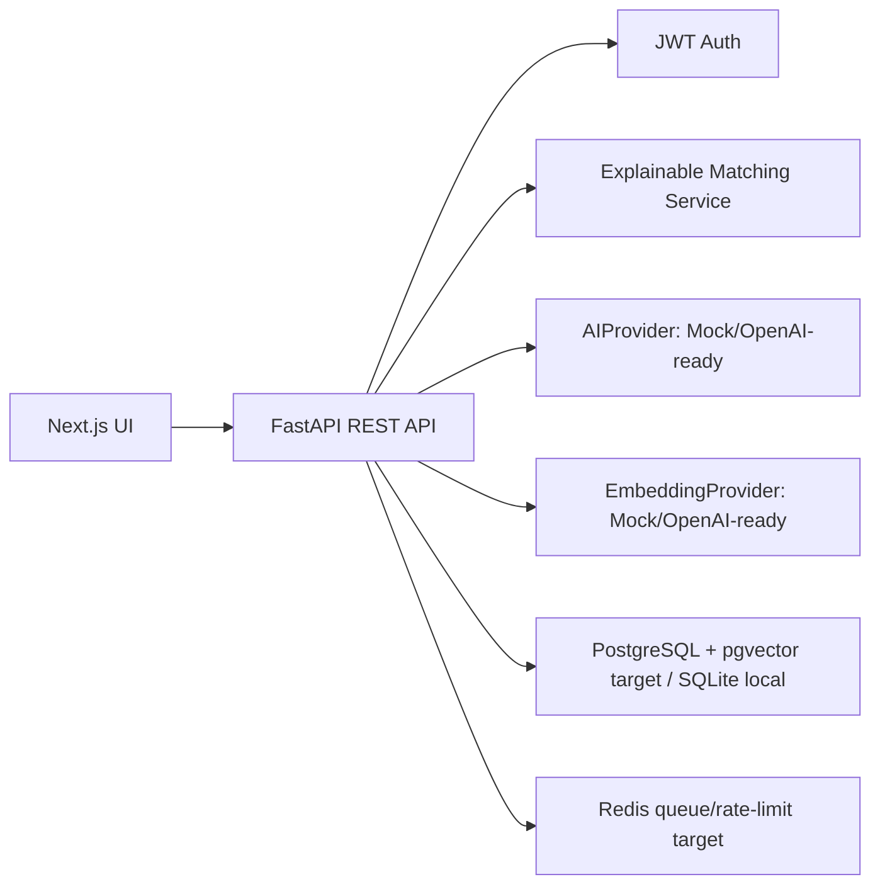

# JinzaIQ

AI-powered intelligence for finding and preparing for tech careers in Japan.

This is a portfolio-grade full-stack application that demonstrates FastAPI, TypeScript/Next.js, secure API design, explainable matching, AI provider abstraction, embeddings, Docker, CI, and AWS-ready architecture.

## What It Does

- Searches Japan technology roles by keyword, city, Japanese level, visa signal, and skill.
- Scores each job against a candidate profile with an explainable hybrid scoring engine.
- Uses deterministic weighted scoring plus semantic similarity and a validated AI explanation layer.
- Shows job details with skills, salary, freshness, visa caution, language fit, and recommendations.
- Generates a Japan career gap analysis and learning order.
- Includes saved job/application-tracker surfaces and company profiles.
- Includes admin JSON job import, duplicate detection, and worker-job status endpoints.
- Runs without an LLM key through mock AI and embedding providers.

## Architecture



## Local Setup

```bash
cd /Users/suproteek/Developer/JapanTech-Intelligence
cp .env.example .env

cd backend
python3 -m venv .venv
source .venv/bin/activate
pip install -r requirements.txt
uvicorn app.main:app --reload

cd ../frontend
npm install
npm run dev
```

Open [http://localhost:3000](http://localhost:3000). API docs are at [http://localhost:8000/docs](http://localhost:8000/docs).

Docker path:

```bash
cd /Users/suproteek/Developer/JapanTech-Intelligence
docker compose up --build
```

## Deploying on Vercel

Deploy either from the repo root, using the included root `vercel.json`, or set Vercel **Root Directory** to `frontend`. Set `NEXT_PUBLIC_API_URL` in Vercel to the deployed FastAPI backend URL. Full instructions are in [DEPLOYMENT.md](/Users/suproteek/Developer/JapanTech-Intelligence/DEPLOYMENT.md).

The Vercel frontend includes a demo-data fallback so the portfolio UI loads even before the backend URL is connected.

## Demo Flow For Interviews

1. Start backend and frontend.
2. Open the dashboard and explain the readiness score.
3. Go to Jobs, filter for `Tokyo`, `None`, and `AWS`.
4. Open a job detail page and walk through the score breakdown.
5. Show that visa sponsorship is never treated as a legal guarantee.
6. Open Career Gap and explain how the roadmap is derived from recurring missing skills.
7. Show `backend/app/services/scoring.py` and `backend/app/ai/providers.py` to discuss deterministic scoring plus validated AI output.

## Tech Stack

- Backend: Python, FastAPI, Pydantic, SQLAlchemy, JWT auth, pytest, ruff.
- Frontend: Next.js, React, strict TypeScript, responsive CSS, lucide icons, Vitest.
- Data/AI: modular job ingestion seed source, mock embeddings, cosine semantic scoring, AI provider abstraction.
- DevOps: Dockerfiles, Docker Compose, GitHub Actions, Terraform starter for AWS Tokyo region.

## Important Safety Notes

Visa sponsorship indicators are inferred from listing text and are not legal advice. The UI and API use cautious wording such as "likely", "possible", "not mentioned", and "verify directly with employer".

## Commands

```bash
cd backend && source .venv/bin/activate && ruff check . && pytest
cd frontend && npm run typecheck && npm test && npm run build
```
